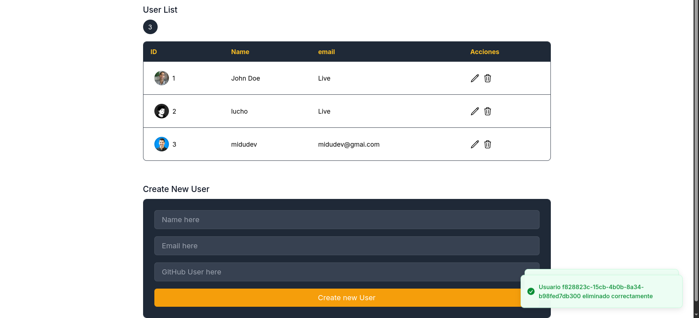

# 🚀 UserHub - CRUD Mastery with React & Redux

<div align="center">
  
  
  
  
</div>

 <!-- Add actual screenshot path -->

## 🌟 **Project Odyssey**
**UserHub** es una inmersión práctica en el ecosistema moderno de React, diseñado para dominar:
- 🧠 Gestión de estado complejo con **Redux Toolkit**
- ⚡ Rendimiento extremo con **Bun** (el runtime JavaScript más rápido)
- 🎨 Diseño elegante con **Tailwind CSS**
- 🚨 Sistema de notificaciones en tiempo real
- 💾 Persistencia de datos local avanzada

## 🛠️ **Tecnologías Revolucionarias**
| Categoría          | Tecnologías                                                                 |
|---------------------|-----------------------------------------------------------------------------|
| **Runtime**        |                     |
| **Frontend**       |   |
| **State Management**|  |
| **Styling**        |  |
| **Notifications**  |                       |

## 🎯 **Features Destacados**
- ✨ **CRUD Completo** con validación en tiempo real
- 🚦 **Middleware Avanzado** para sincronización con APIs
- 📂 **Persistencia de Estado** en LocalStorage
- 💫 **Optimizaciones de Rendimiento** con Bun
- 📱 **Diseño Responsive** priorizando mobile-first
- 🛡️ **Rollback Automático** en fallos de API

## 🚀 **Instalación Express**
```bash
# 1. Clona el repositorio
git clone https://github.com/tu-usuario/userhub.git

# 2. Instala dependencias (¡a velocidad Bun!)
bun install

# 3. Inicia la aplicación
bun dev

# ¡Listo! Abre http://localhost:3000